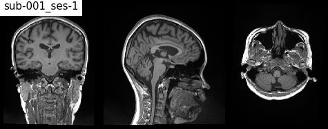

# BBX Experiment
## NIBL UNC Chapel Hill  

  
  
  
Repository for code and data related to the BBX Experiment under [NIBL UNC Chapel Hill](https://niblunc.org/projects/)

[code](https://github.com/niblunc/bbx/tree/master/code) : code files for the fMRI preprocessing pipeline, FSL feat modeling and other processes.  

[data](https://github.com/niblunc/bbx/tree/master/data) : data files for quality checks, and other behavioral or scan information.
